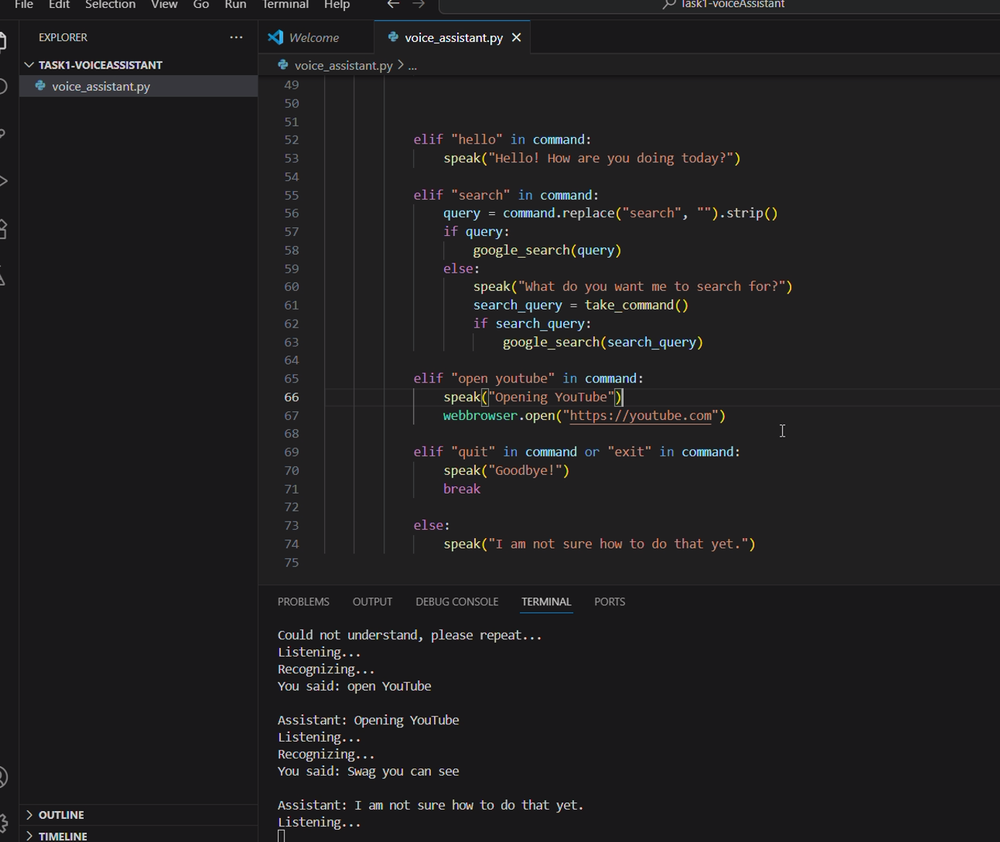

# 🎙️ Voice Assistant in Python

A simple **voice-controlled assistant** built in Python using `speech_recognition` and `pyttsx3`.  
It can tell you the time, search Google, open YouTube, greet you, and more.

---

## ✨ Features
- 🕒 Tells the current time
- 💬 Greets the user
- 🔍 Google search via voice
- ▶️ Opens YouTube
- 🎤 Listens and responds using voice commands
- ❌ Exit the assistant with "quit" or "exit"

---

## 📷 Screenshot



---

## 🛠 Installation & Usage

1. **Clone the repository**
   ```bash
   git clone https://github.com/Seja-git/Task1_voiceAssistance.git
   cd Task1_voiceAssistance

pip install -r requirements.txt

voice-assistant/
│
├── voice_assistant.py       # Main program
├── requirements.txt         # Dependencies
└── README.md                # Project documentation
